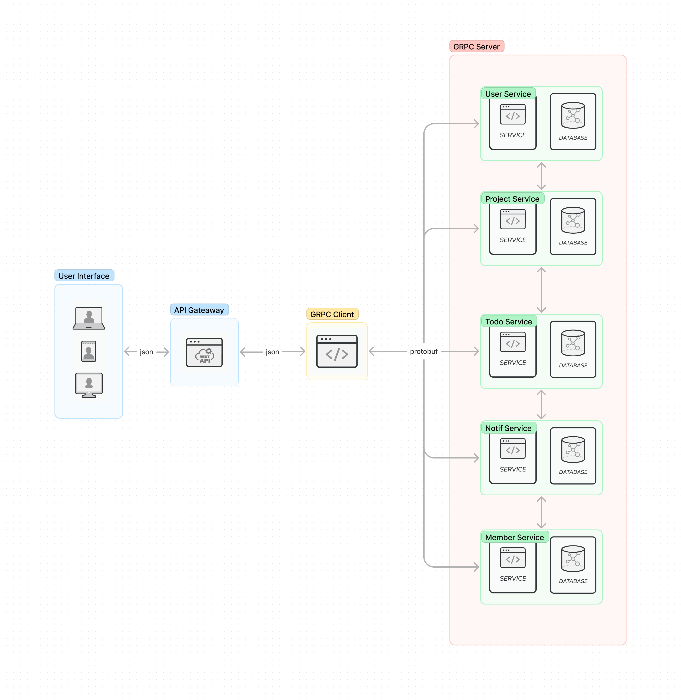

# Whadopro BackEnd

## Tech Stack

- Python 3.11.x
- Pyramind 2.0.x
- Grpcio 1.41.x
- Grpcio-tools 1.41.x
- Sqlalchemy 1.4.x
- alembic 1.7.x
- mysqlclient 2.1.x

## How to run

- Make sure you have python 3.10.x or higher installed

```bash
python3 --version
```

- Clone this repository

```bash
git clone https://github.com/maybeenang/whadopro-backend.git
```

- Change directory

```bash
cd whadopro-backend
```

- Create Database

```bash
mysql -u root -p
```

```sql
CREATE DATABASE whadopro;
```

- run setup.sh

```bash
./setup.sh
```

- run server

```bash
./run.sh
```

## All done 🎉🎉🎉

### How to use

- to see list of endpoint, open `endpoint.rest` file

## Architecture



if you want to see what did i do with this project, you can see frontend repository [here](https://github.com/maybeenang/whadopro-frontend)
